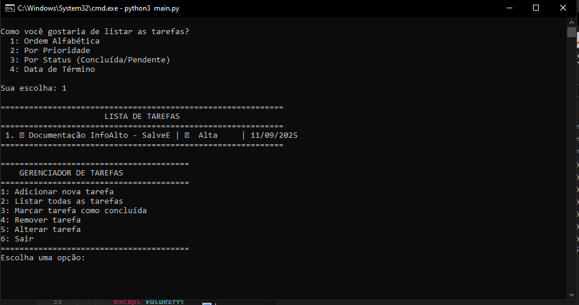

# 📝 Gerenciador de Tarefas

Um gerenciador de tarefas completo e intuitivo desenvolvido em Python, oferecendo tanto uma interface de linha de comando quanto uma interface gráfica moderna.


## ✨ Funcionalidades

### 🖥️ Interface de Linha de Comando (CLI)
- ➕ **Adicionar tarefas** com descrição, prioridade e data de término
- 📋 **Listar tarefas** com múltiplas opções de ordenação
- ✅ **Marcar como concluída** ou pendente
- ✏️ **Editar tarefas** existentes
- ❌ **Remover tarefas**
- 🔍 **Filtrar** por status (todas, pendentes, concluídas)



### 🖼️ Interface Gráfica (GUI)
- 🎨 **Design moderno e minimalista**
- 📊 **Painel de estatísticas** em tempo real
- 🎯 **Filtros visuais** para organização
- ⚠️ **Alertas visuais** para tarefas atrasadas
- 🌈 **Código de cores** por prioridade
- 📝 **Edição por duplo clique**


### 💾 Funcionalidades Gerais
- 📁 **Persistência de dados** em JSON
- 🔄 **Sincronização automática** entre CLI e GUI
- 📅 **Sistema de datas** com validação
- 🚨 **Detecção de tarefas atrasadas**
- 📈 **Cálculo de progresso** automático

## 🚀 Instalação

### Pré-requisitos
- Python 3.7 ou superior
- Tkinter (geralmente incluído com Python)

### Clonando o repositório
```bash
git clone https://github.com/seu-usuario/gerenciador-tarefas.git
cd gerenciador-tarefas
```

### Instalação das dependências
```bash
# Não são necessárias dependências externas
# O projeto usa apenas bibliotecas padrão do Python
```

## 🎮 Como Usar

### Interface de Linha de Comando
```bash
python main.py
```

### Interface Gráfica
```bash
python gui_gerenciador.py
```

## 📸 Screenshots

### Interface CLI
```
========================================
          GERENCIADOR DE TAREFAS
========================================
1: Adicionar nova tarefa
2: Listar todas as tarefas
3: Marcar tarefa como concluída
4: Remover tarefa
5: Alterar tarefa
6: Sair
========================================
```

### Interface GUI
*Interface gráfica moderna com painéis organizados, estatísticas em tempo real e código de cores por prioridade.*

## 📁 Estrutura do Projeto

```
gerenciador-tarefas/
├── main.py                    # Ponto de entrada CLI
├── gui_gerenciador.py         # Interface gráfica
├── gerenciador_tarefas.py     # Lógica de negócio
├── gerenciador_arquivos.py    # Manipulação de arquivos
├── interface_usuario.py       # Interface CLI
├── tarefas.json              # Arquivo de dados (criado automaticamente)
├── README.md                 # Este arquivo
└── requirements.txt          # Dependências (vazio - usa apenas stdlib)
```

## 🎯 Exemplos de Uso

### Adicionando uma Tarefa
1. **CLI**: Execute `python main.py`, escolha opção 1
2. **GUI**: Clique em "➕ Adicionar Tarefa"

### Organizando por Prioridade
- **Alta** 🔴: Tarefas urgentes
- **Média** 🟡: Tarefas importantes
- **Baixa** 🟢: Tarefas de baixa prioridade

### Sistema de Status
- ✅ **Concluída**: Tarefa finalizada
- ⏳ **Pendente**: Aguardando execução
- ⚠️ **Atrasada**: Passou da data limite

## 🛠️ Recursos Técnicos

### Tecnologias Utilizadas
- **Python 3.7+**: Linguagem principal
- **Tkinter**: Interface gráfica
- **JSON**: Armazenamento de dados
- **datetime**: Manipulação de datas

### Padrões de Projeto
- **MVC**: Separação de responsabilidades
- **Modularização**: Código organizado em módulos
- **Tratamento de Erros**: Validações robustas
- **Persistência**: Salvamento automático

## 📊 Funcionalidades Avançadas

### Ordenação Inteligente
- 🔤 **Alfabética**: Por descrição
- 🎯 **Prioridade**: Alta → Média → Baixa
- 📅 **Data**: Por data de término
- ✅ **Status**: Pendentes → Concluídas

### Estatísticas
- 📈 **Progresso geral** em percentual
- 📊 **Total de tarefas** cadastradas
- ⏳ **Tarefas pendentes**
- ⚠️ **Tarefas atrasadas**

## 🤝 Contribuindo

1. **Fork** o projeto
2. **Crie** uma branch para sua feature (`git checkout -b feature/AmazingFeature`)
3. **Commit** suas mudanças (`git commit -m 'Add some AmazingFeature'`)
4. **Push** para a branch (`git push origin feature/AmazingFeature`)
5. **Abra** um Pull Request

### 💡 Ideias para Contribuição
- [ ] Sistema de notificações
- [ ] Exportação para PDF/Excel
- [ ] Temas personalizáveis
- [ ] Sincronização em nuvem
- [ ] Aplicativo mobile
- [ ] Sistema de categorias/tags
- [ ] Relatórios avançados
- [ ] Integração com calendários

## 🐛 Reportando Bugs

Encontrou um bug? Ajude-nos a melhorar!

1. Verifique se o bug já foi reportado nas [Issues](https://github.com/seu-usuario/gerenciador-tarefas/issues)
2. Se não encontrou, [crie uma nova issue](https://github.com/seu-usuario/gerenciador-tarefas/issues/new)
3. Inclua:
   - Descrição detalhada do problema
   - Passos para reproduzir
   - Sistema operacional e versão do Python
   - Screenshots (se aplicável)

## 📝 Changelog

### v1.0.0 (2024-XX-XX)
- ✅ Interface CLI completa
- ✅ Interface GUI moderna
- ✅ Sistema de persistência JSON
- ✅ Validação de datas
- ✅ Filtros e ordenação
- ✅ Sistema de prioridades
- ✅ Detecção de tarefas atrasadas

## 📄 Licença

Este projeto está licenciado sob a MIT License - veja o arquivo [LICENSE](LICENSE) para detalhes.

## 👨‍💻 Autor

**Seu Nome**
- GitHub: [@Meu Github](https://github.com/Dev-Russo)
- LinkedIn: [Perfil Linkedin](https://www.linkedin.com/in/murilo-russo-544158204)
- Email: murilo.russo@outlook.com

## 🙏 Agradecimentos

- Comunidade Python pela documentação excelente
- Desenvolvedores que contribuíram com feedback
- Usuários beta que testaram as funcionalidades

---

<div align="center">

### ⭐ Se este projeto te ajudou, considere dar uma estrela!

**[⬆ Voltar ao topo](#-gerenciador-de-tarefas)**

</div>
